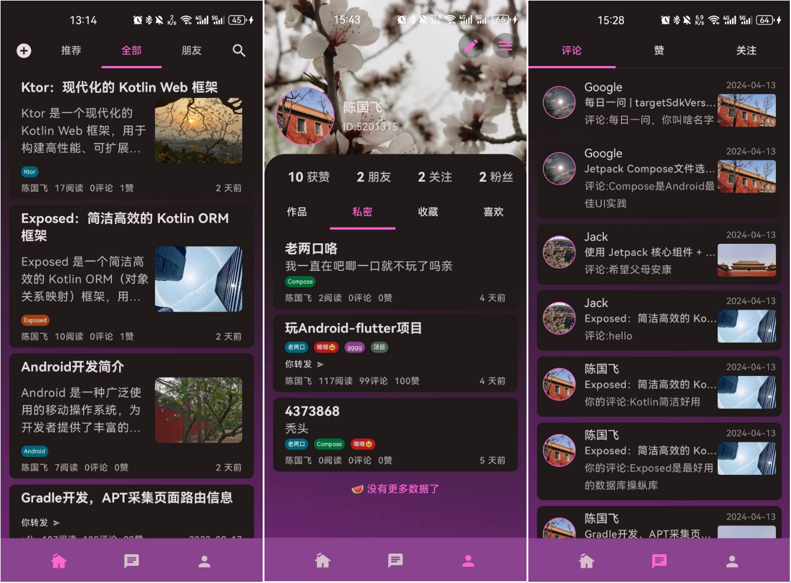
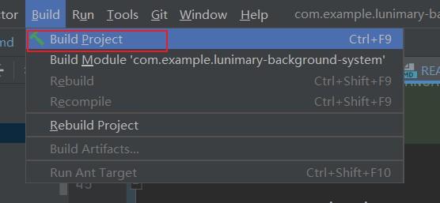

Lunimary Blog Background System
==================

**Lunimary Blog Background System。该项目是一个博客后台系统，技术栈使用了 Kotlin + Exposed + Ktor Client实现。（[Ktor前端项目](https://github.com/cenguofei/Luminary-android)）**

# Screenshots

## The Dark Mode Screens


## The Light Mode Screens


## More Screenshots see directory <a href ="https://github.com/cenguofei/Luminary-android/tree/main/docs/images">

# Architecture

The **Lunimary Blog** app follows the [official architecture guidance](https://developer.android.com/topic/architecture).

# UI
The app was designed using [Material 3 guidelines](https://m3.material.io/).
The Screens and UI elements are built entirely using [Jetpack Compose](https://developer.android.com/jetpack/compose).

The app has two themes:

- Dark Theme -  uses predefined dark colors.
- Light theme - uses predefined light colors.

# How to run this system?
- clone the project use [Ultimate Intellij Idea](https://www.jetbrains.com/zh-cn/idea/download)
- Configure Mysql Database, open file: com/example/plugins/database/Databases.kt
```kotlin
private fun createHikariDataSource() = HikariDataSource(
  HikariConfig().apply {
    driverClassName = "com.mysql.cj.jdbc.Driver"
    jdbcUrl = "jdbc:mysql://your_host:your_port/your scheme"
    username = "your username"
    password = "your password"
    maximumPoolSize = 12
    isAutoCommit = false
    transactionIsolation = "TRANSACTION_REPEATABLE_READ"
    validate()
  }
)
```
- Collect Database using idea.
  - open the view/Tool Windows/Database
  
    [Open The Idea Database](docs/images/open_db.png)

  - Select Mysql or other database product you want.

    - [Select a database product](docs/images/select_mysql.png)
  
  - Input database information.
  
    - [Input database information](docs/images/configure_db.png)

- Build Project

  

- Run Project

  

- Finally, interact with client [Lunimary Android](https://github.com/cenguofei/Luminary-android). You can also use Postman, [Apifox](https://apifox.com/) to test api.
