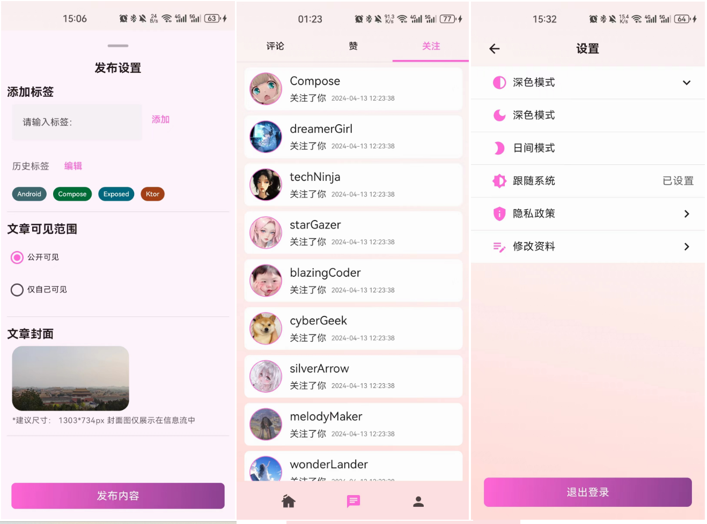
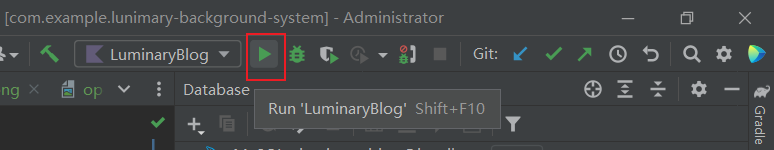

Lunimary Blog Background System
==================

**Lunimary Blog Background System。该项目是一个博客后台系统，技术栈使用了 Kotlin + Exposed + Ktor Client实现。（[Ktor前端项目](https://github.com/cenguofei/Luminary-android)）**

# Screenshots

## The Dark Mode Screens


## The Light Mode Screens


## More Screenshots see directory <a href ="https://github.com/cenguofei/Luminary-android/tree/main/docs/images">

# Architecture

## [Kotlin](https://kotlinlang.org/)
> Kotlin编写后端项目的好处包括：优秀的Java互操作性、简洁的语法、类型安全、强大的工具支持（如Ktor、Spring）、协程支持、减少样板代码、提高开发效率。

## [Ktor](https://ktor.io/docs/welcome.html)
> Ktor是一个轻量级、灵活的Kotlin编写的Web框架，用于构建异步和协程基础的后端应用程序。它提供了简洁的API、内置的协程支持、易于扩展的特性以及现代化的路由功能，使得开发者能够快速构建高性能的Web应用程序。

## [Exposed](https://github.com/JetBrains/Exposed)
> Exposed是一个轻量级、简单易用的Kotlin SQL库，用于在Kotlin应用程序中处理数据库操作。它提供了类型安全的查询构建器和DSL（领域特定语言），支持多种数据库后端，包括SQLite、MySQL和PostgreSQL。Exposed的设计目标是提供直观的API，使得开发者能够以更加优雅和类型安全的方式进行数据库操作，同时减少样板代码的编写。

## Security
- Session
- JWT: JWT（JSON Web Token）是一种用于在网络上安全传输信息的开放标准（RFC 7519）。它通过使用JSON对象在用户和服务器之间传递被声明的信息，经过数字签名验证，以确保信息的完整性和可信度。JWT由三部分组成：头部（Header）、载荷（Payload）和签名（Signature）。JWT适用于身份验证和授权机制，可用于在不同系统之间安全地传递声明信息。

# How to run this system?
- clone the project use [Intellij Idea Ultimate](https://www.jetbrains.com/zh-cn/idea/download)
- Configure Mysql Database, open file: com/example/plugins/database/Databases.kt
```kotlin
private fun createHikariDataSource() = HikariDataSource(
  HikariConfig().apply {
    driverClassName = "com.mysql.cj.jdbc.Driver"
    jdbcUrl = "jdbc:mysql://your_host:your_port/your scheme"
    username = "your username"
    password = "your password"
    maximumPoolSize = 12
    isAutoCommit = false
    transactionIsolation = "TRANSACTION_REPEATABLE_READ"
    validate()
  }
)
```
- Collect Database using idea.
  - open the view/Tool Windows/Database
  
    

  - Select Mysql or other database product you want.

    - 
  
  - Input database information.
  
    - 

- Build Project

  

- Run Project

  

- Finally, interact with client [Lunimary Android](https://github.com/cenguofei/Luminary-android). You can also use Postman, [Apifox](https://apifox.com/) to test api.
